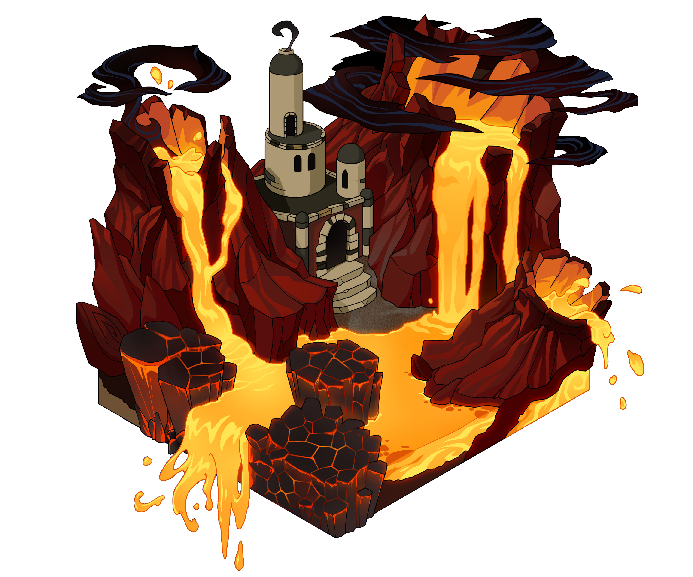

# 2. Emblazion

The land of orange, of the emotional aspects of existence. Of the creative force that lies within you, and of the sexual energy that seeks to be released through you.

The inhabitants here have as a main mission the harvesting of the Ignis Essence.

### Cities:

- Lava Landing, home of the Lava Lakes, which with their orange liquid symbolize passion. Here is where Emblazions harvest the Ignis Essence.
- Amber Atrium, home of the Amber Cascade. A waterfall that shines like amber in sunlight. This is the main trading hub and business center of Emblazion.
- Frond Fiesta, home of the Fire Fronds Forest, full of trees with orange foliage that appears to be on fire. This is the city that hosts all major festivals and celebrations.

### Celebrations:

- Festival of Lights: Celebrating the fire within. Featuring thousands of lanterns.
- Passion Play: A theatre festival.
- Emotion Day: A day of expressing and acknowledging emotions.
