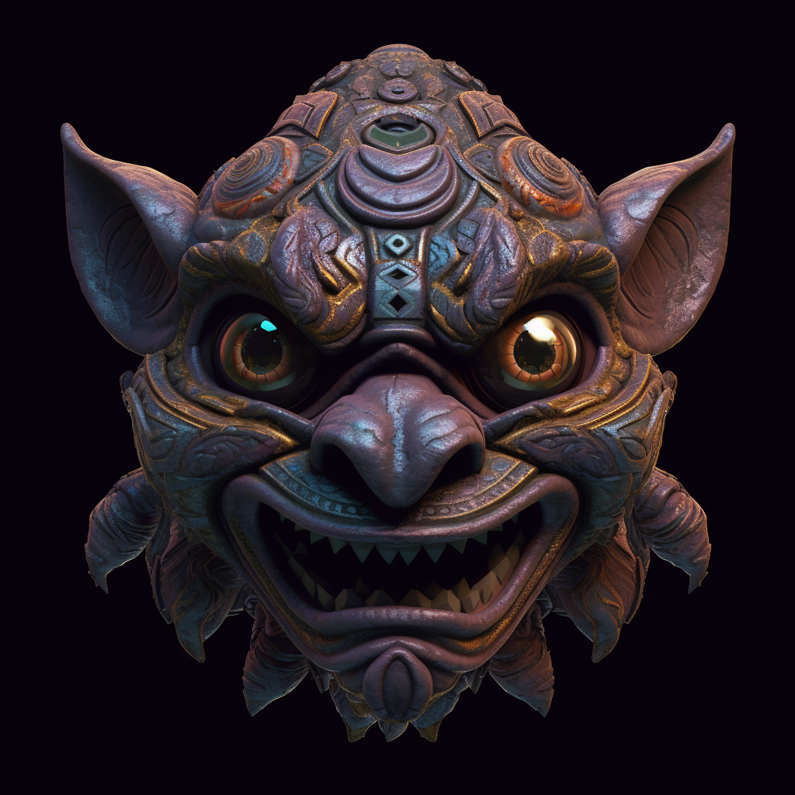

# Primordia - The Primordial Howl

This mask is made from hardened lava, rough to the touch but resilient, symbolizing the robust strength of survival. Jagged, beast-like features are etched into its surface, echoing the rawness of primal energy. Its mouth is set in a roaring snarl, a symbol of resilience and survival. When worn, the eyes ignite with a vibrant red glow, mirroring the relentless fire of life force that drives existence.

On the dawn of Anky's awakening, in the vibrant and wild land of Primordia, the Primordial Howl was born. This mask, infused with the primal essence of life force, reflects a raw, beast-like visage, its vivid red embodying the power of survival. Its creation was a display of unbound energy, the birth cry of existence. Imbued with the life force's raw intensity, the mask empowers the wearer with unmatched physical strength and the unyielding will to survive.
