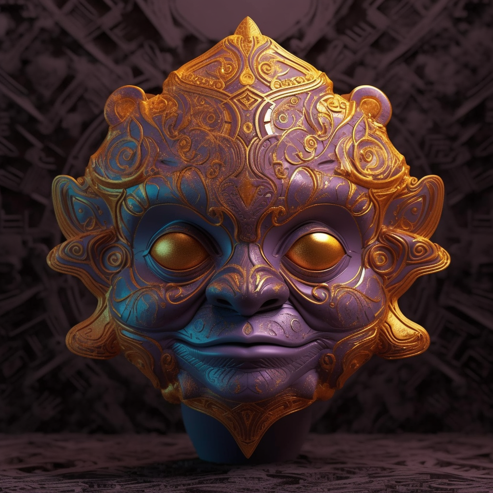

# Emblazion - The Emblaze Aegis

Crafted from a singular piece of sunstone, the Emblaze Aegis is a marvel to behold. It has a smooth, polished surface that seems to dance with the flames of passion within. The mask features a radiant sun symbol on the forehead, symbolizing the burning creative energy. When worn, the eyes sparkle like amber, encapsulating the deep, expressive emotional core of the wearer.

As awareness recognized its ability to feel deeply, the Emblaze Aegis was brought into existence in Emblazion. This mask is radiant, its lively orange hues echoing the vibrancy of emotions and creativity. As it materialized, the land reverberated with a wave of intense passion, igniting a fire of creativity that remains to this day. Wearing this mask allows one to channel their deepest emotions and create masterpieces of art and expression.
