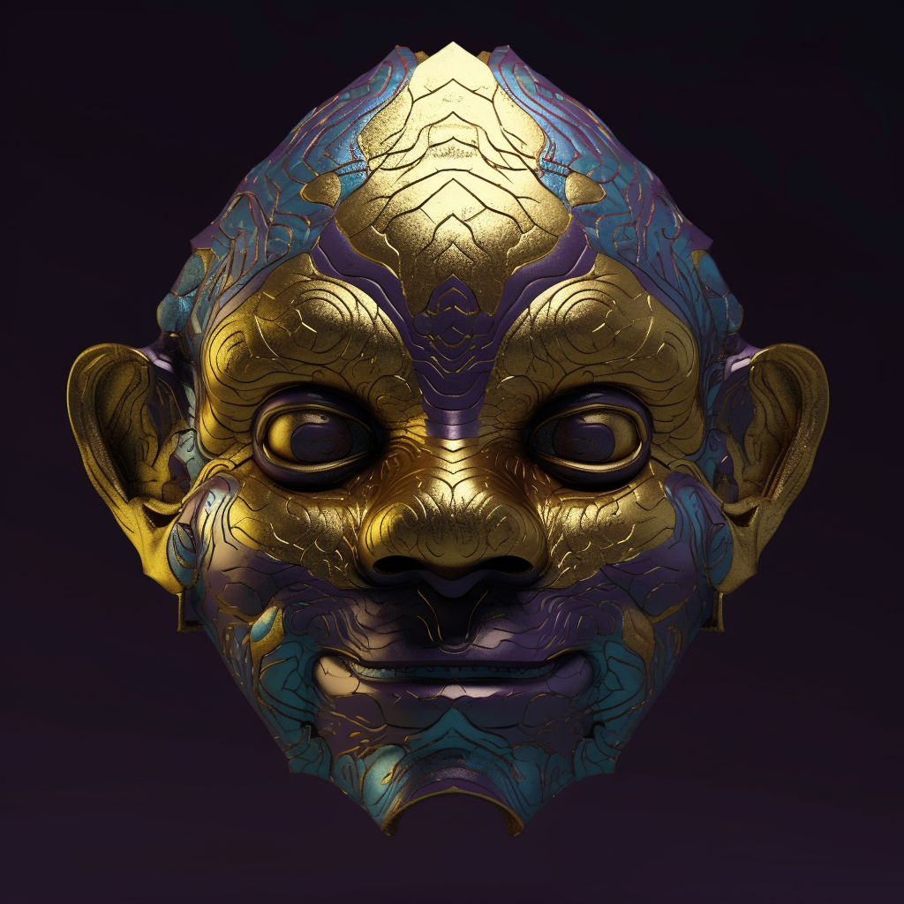

# 3. The Golden Echo

This mask is made from pure, gleaming gold, its reflective surface a testament to the power of will. Etched into the surface is an intricate labyrinth, symbolizing the journey of transformation. When worn, the eyes radiate a strong, golden light, symbolizing the determination and inner strength necessary for personal transformation.

Amid the shimmering sands of Chryseos, as Anky acknowledged its power of transformation, the Golden Echo was manifested. This mask gleams with a lustrous gold color, reflecting the strength and determination associated with the land. Its formation felt like a resounding gong, a call to change and progress. The wearer of this mask is imbued with the courage to face any obstacle and the power to transform oneself.
