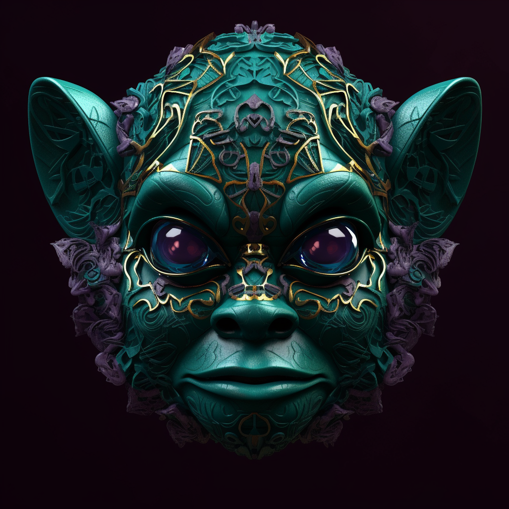

# 4. The Heartveil

Carved from a large emerald, this mask embodies the essence of unconditional love. Soft, curved lines flow across its surface, creating the image of a heart surrounded by a serene aura of leaves. When worn, the eyes shine with a warm, gentle green light, radiating compassion and understanding.

In the tranquil groves of Eleasis, as Anky became aware of the profound power of love and compassion, the Heartveil was formed. This mask shines with a serene green, embodying the unconditional love of this land. The mask's creation was like a gentle sigh, spreading tranquility across the land. When worn, the Heartveil amplifies the wearer's capacity for empathy and compassion, healing rifts and bringing peace.
