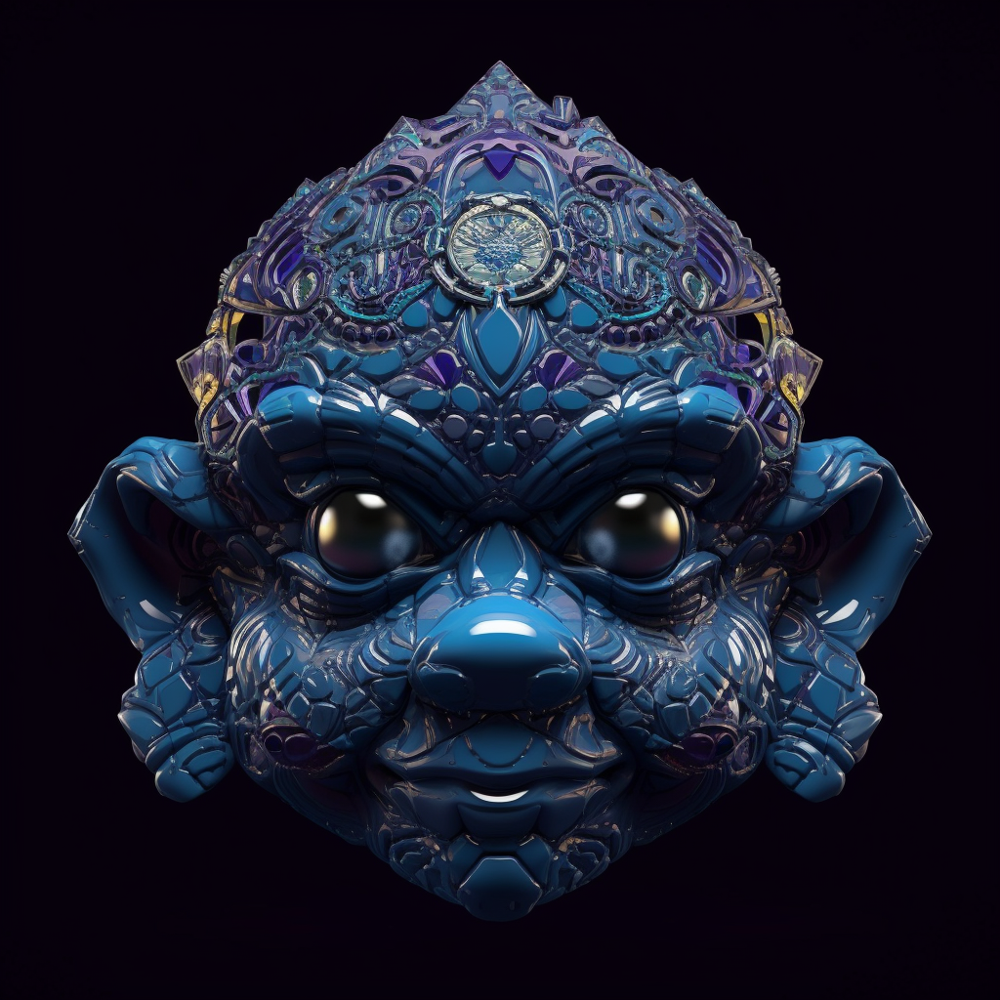

# 5. The Echotide Amulet

Forged from sapphire, this mask is a symbol of communication. It features a stylized wave motif across the mouth area, symbolizing the flow of dialogue. When worn, the eyes radiate a deep blue glow, signifying clarity of thought and expression.

As Anky recognized the power of expression in the echoing caverns of Voxlumis, the Echotide Amulet was manifested. This mask shimmers with a deep blue, reflecting the wisdom and clarity of communication. Its creation resonated like a melodious symphony, encapsulating the importance of truth and dialogue. Wearing this mask grants one a voice that resonates with wisdom and the ability to understand even the most complex languages.
