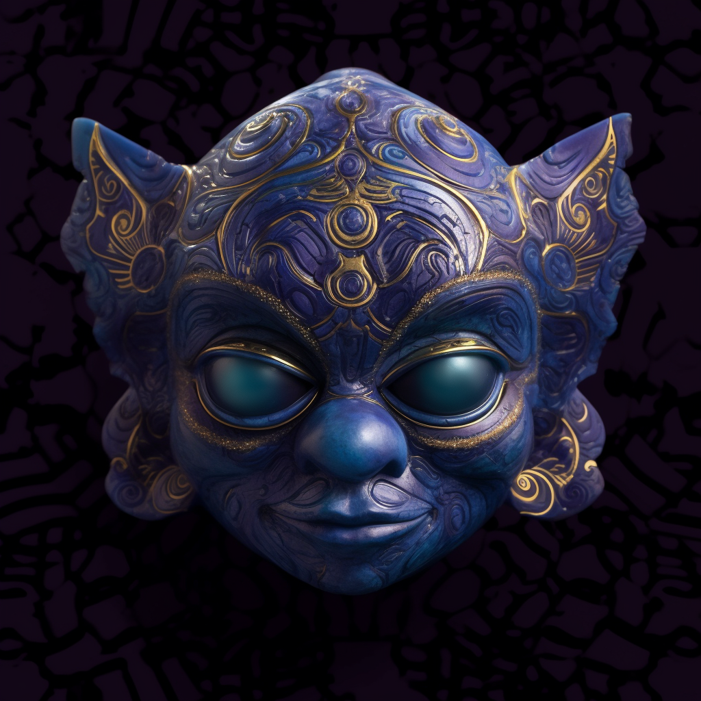

# 6. The Insights Oculus

This mask, crafted from luminescent lapis lazuli, shimmers with an otherworldly glow. It features a single, large eye on the forehead, symbolizing intuition and inner wisdom. When worn, the eyes glow with an intense indigo light, reflecting the wearer's ability to see beyond the physical realm.

Within the mystical Mind's Maze of Insightia, as Anky acknowledged the power of intuition, the Insight's Oculus was born. This indigo mask glows with a mysterious light, embodying the mystical energy of the land. Its creation was like the twinkling of a distant star, a silent proclamation of newfound wisdom. The mask grants its wearer the gift of prophecy and the ability to see the unseen.
