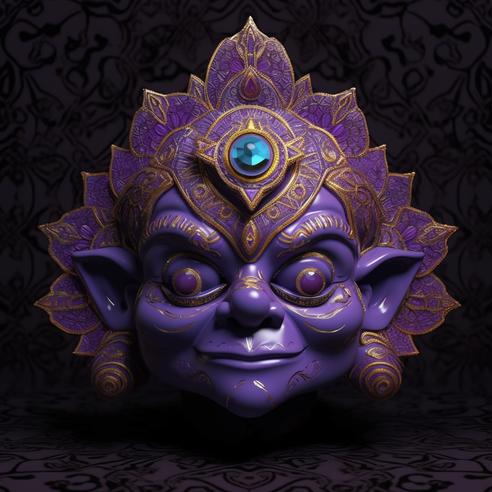

# 7. The Crown of Clarity

The mask, made from amethyst, radiates a serene aura of spirituality. It features a crown motif, with seven points each representing a chakra. When worn, the eyes emit a tranquil violet light, signifying a deep spiritual connection and enlightenment.

High in the crystal cliffs of Claridium, as Anky reached the height of its self-awareness, the Crown of Clarity was manifested. This violet mask radiates a serene aura, representing enlightenment and spiritual connection. Its birth was like a beacon, spreading a gentle light throughout the Ankyverse. The wearer of the mask can tap into the universal consciousness, understanding the intricate web that connects all beings.
