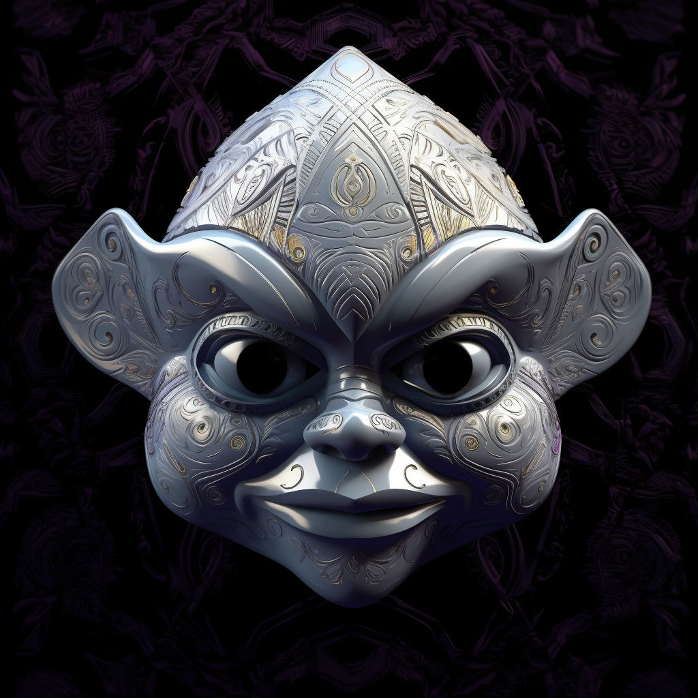

# 8. The Poets Whisper

This mask is crafted from pure quartz, embodying the purity of creation. It features a quill and ink motif, symbolizing the power of creation through words. When worn, the eyes glow with a radiant white light, reflecting the boundless creativity of the wearer.

In the inspiring Creation Cradle of Poiesis, as Anky reveled in the act of creation, the Poet's Whisper was born. This white mask pulses with a captivating glow, representing the purity and boundlessness of creation. Its creation echoed through the universe, a gentle whisper promising infinite possibilities. The mask bestows its wearer with boundless creativity and the power to weave reality with their words.
